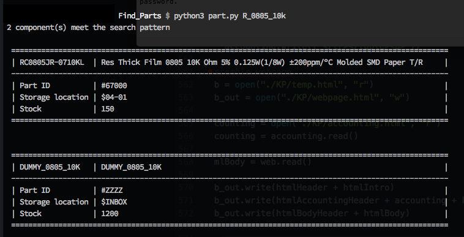

# PKFinder

A command line interface to a PartKeepr mySQL database. Performs ‘intelligent’ part lookup for jellybean components. It returns stock levels, part IDs and location.

Usage

```part.py partno```

e.g. ```part.py C0805C103K5RACTU```

‘Jellybean’ components can be searched for using the footprint combined with the part value.

Examples

```C_0805_10n``` will search for 10nF capacitors in an 0805 footprint.

```R_1206_10K``` will search for 10K resistors in a 1206 footprint.

The script will accept values in a variety of forms e.g. C_0805_100n or C_0805_0.1u or C_0805_0u1 are all equivalent.


The connection to the PartKeepr database is defined by the settings in the config.ini file which should be populated with the necessary path to the database, PartKeepr username and password.


